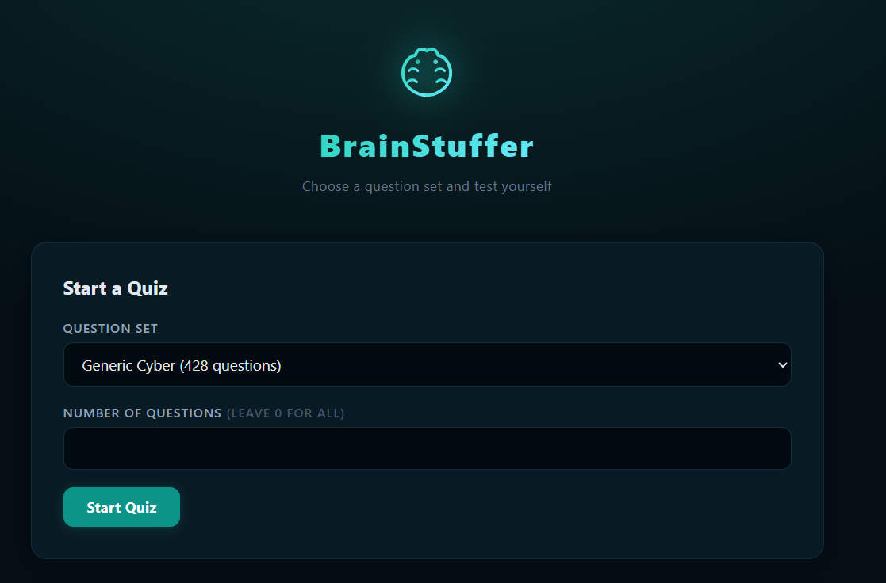

# BrainStuffer

<p align="center">
  
</p>

A client-side flashcard quiz app hosted on GitHub Pages. Load multiple-choice questions, get scored on accuracy and speed, and review anything you got wrong.

## Live Site

**https://brainstuffer.co.uk**

## Features

- Pick from included quiz sets or upload your own (YAML or JSON)
- Answers shuffled randomly on every run
- Questions answered **incorrectly** or **too slowly** (> 30s) are re-shown in a review round
- Score is calculated on first-pass performance only
- Download incorrect answers as JSON for later drilling
- Download a YAML template or AI prompt to generate new quiz sets
- 5 colour skins (Midnight, Neon, Crimson, Ocean, Amber)
- Brain damage system, celebration animations, and easter eggs
- Fully mobile responsive

## Local Testing

```bash
cd docs
python -m http.server 8080
```

Then open **http://127.0.0.1:8080** in your browser.

## Project Structure

```
brainstuffer/
├── docs/                       # GitHub Pages root
│   ├── index.html              # Single-page application
│   ├── favicon.svg             # Browser tab icon
│   ├── 404.html                # SPA path redirect
│   └── data/
│       ├── manifest.json       # Quiz file index
│       ├── crystal_palace.json # Crystal Palace / PIC tradecraft (75 questions)
│       ├── generic_cyber.json  # General cybersecurity (428 questions)
│       └── interview.json      # Technical interview prep (100 questions)
├── convert_to_json.py          # YAML to JSON converter for adding new quizzes
├── .gitignore
└── README.md
```

## Adding New Quiz Files

1. Create a `.yml` file in the project root using the format below
2. Run the converter:
   ```bash
   python convert_to_json.py
   ```
3. Commit and push -- the new quiz appears on the site

Alternatively, upload quiz files directly in the browser (no rebuild needed).

## YAML Format

The first answer in the list is always the correct one. Answers are shuffled before display.

```yaml
---
- question_id: 1
  question: "What does ARP stand for?"
  answers:
    - "Address Resolution Protocol"   # correct - must be first
    - "Automated Routing Protocol"
    - "Application Request Payload"
    - "Access Registration Protocol"
```

## Included Quiz Sets

| File | Description | Questions |
|------|-------------|-----------|
| `crystal_palace.json` | Crystal Palace linker / PIC tradecraft | 75 |
| `generic_cyber.json`  | General cybersecurity knowledge | 428 |
| `interview.json`      | Technical interview prep (6 categories) | 100 |
